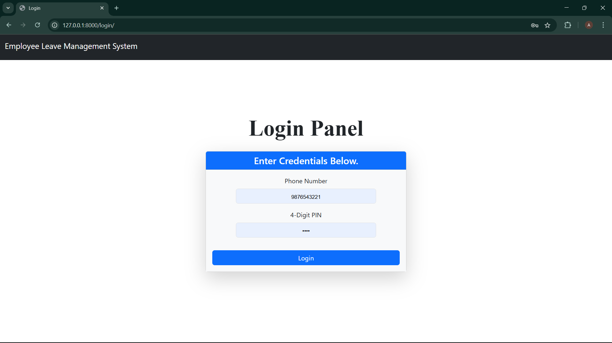
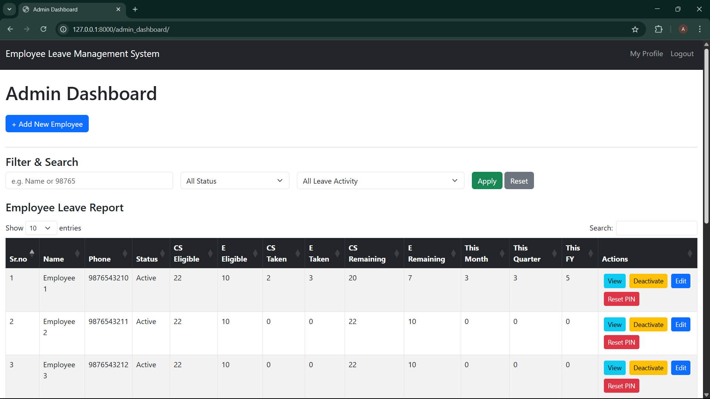
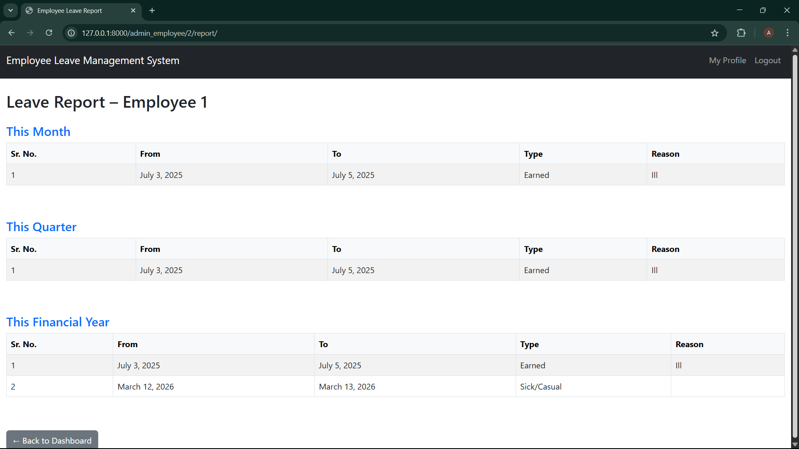
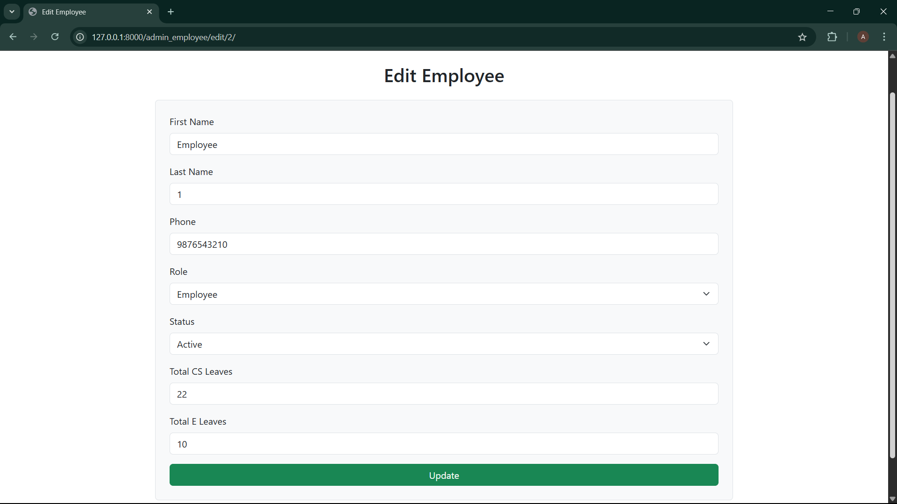
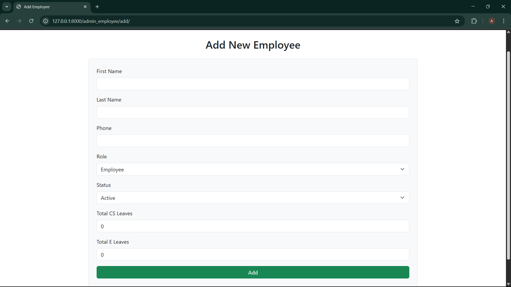
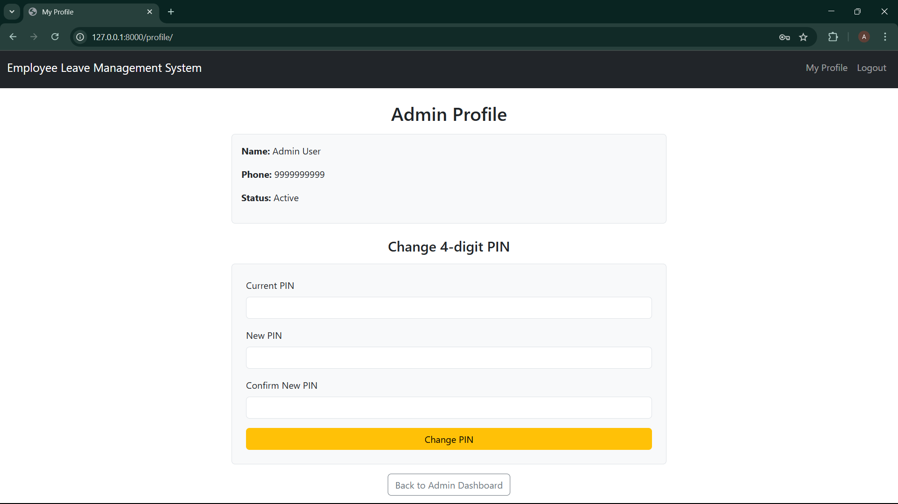
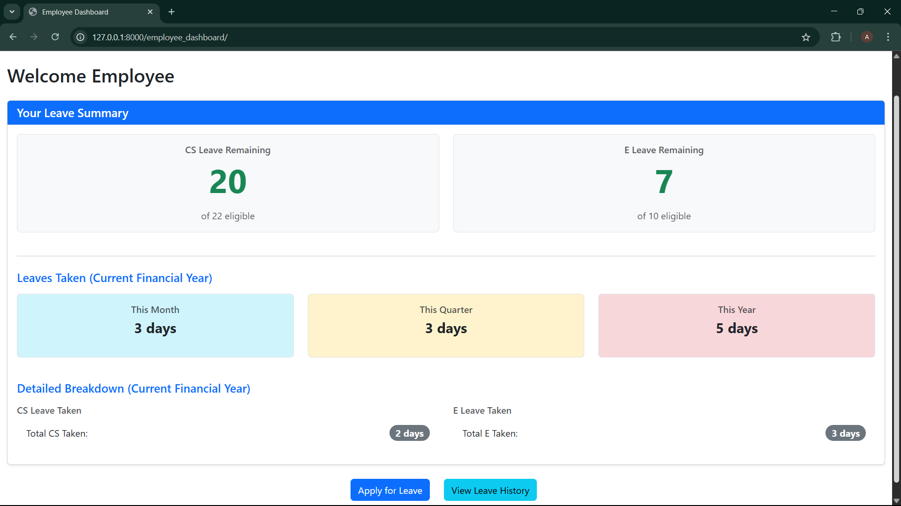
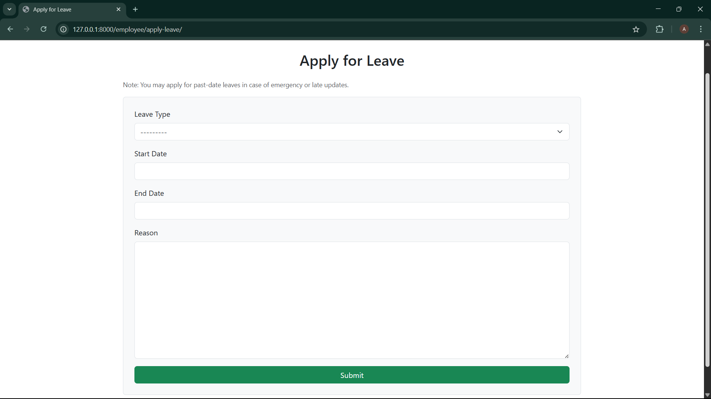
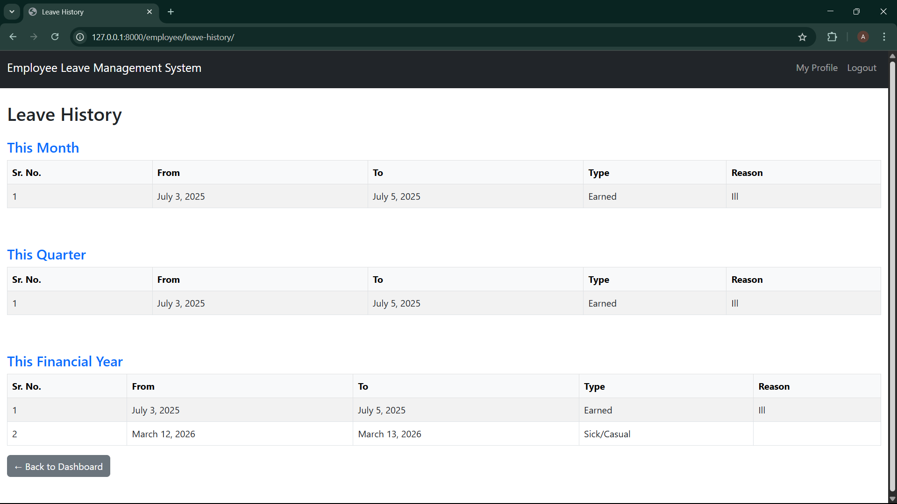

# 🗂️ Employee Leave Management System

A **web-based leave management system** built using Django and MySQL. It allows admins to manage employee leave requests, and employees to apply for and track their leaves efficiently.

---

## 📌 Key Features

### 👩‍💼 Admin Features
- Add/Edit/Delete employee records
- Activate or deactivate employee accounts
- Reset employee PIN to default (0000)
- View detailed employee leave reports (Month, Quarter, Financial Year)
- Search, filter, and sort with DataTables.js
- Dynamic leave tracking (date-based leave calculation)

### 👨‍🔧 Employee Features
- Login with phone number and 4-digit PIN
- Dashboard with leave stats (CS/E Taken, Remaining)
- Apply for current or past leaves
- View personal leave history (Month, Quarter, Year)
- Change own PIN via secure profile

---

## 🚀 Quick Start Guide

### ✅ Prerequisites
- Python 3.8+
- MySQL 5.7+ or MySQL 8
- MySQL Workbench (for DB management)
- Git (optional)

---

### 🔧 1. Clone the Repository

```bash
git clone https://github.com/your-username/employee-leave-mgmt.git
cd new
```

---

### 🔧 2. Create & Activate a Virtual Environment

```bash
# On Windows
python -m venv env
env\Scripts\activate

# On Mac/Linux
python3 -m venv env
source env/bin/activate
```

---

### 📦 3. Install Dependencies

```bash
pip install -r requirements.txt
```

> Make sure `mysqlclient` or `pymysql` is installed if you're using MySQL:
```bash
pip install pymysql
```

If using PyMySQL, add the following in `__init__.py`:

```python
import pymysql
pymysql.install_as_MySQLdb()
```

---

### 🗄️ 4. Configure MySQL Database

1. Open **MySQL Workbench**
2. Create a new schema:
   - Name: `leave_management_db`
   - Collation: `utf8mb4_general_ci`

3. Update your `settings.py`:

```python
DATABASES = {
    'default': {
        'ENGINE': 'django.db.backends.mysql',
        'NAME': 'leave_management_db',
        'USER': 'root',  # or your chosen MySQL user
        'PASSWORD': 'your_password',
        'HOST': 'localhost',
        'PORT': '3306',
    }
}
```

---

### 🛠️ 5. Run Migrations

```bash
python manage.py makemigrations
python manage.py migrate
```

---

### 🧪 6. Run the Server

```bash
python manage.py runserver
```

Visit [http://127.0.0.1:8000](http://127.0.0.1:8000) in your browser.

---

## 🔐 Demo Credentials

### 👩 Admin
- **Phone:** `9999999999`
- **PIN:** `1234`

### 👨 Employee
- **Phone:** `9876543210`
- **PIN:** `1010`

---

## 🛠️ Tech Stack

| Technology | Purpose                        |
|------------|--------------------------------|
| Django     | Web framework (backend)        |
| MySQL      | Relational database            |
| Bootstrap  | UI Styling                     |
| DataTables.js | Table filtering/sorting     |
| Flatpickr  | Calendar date picker UI        |

---

## 📸 Optional Screenshots

You can add screenshots here like:

```markdown









```

## 📝 License

This project is under the [MIT License](LICENSE).

---

## 🙋‍♂️ Developer

**Abhishek Bhosale**  
MCA (CS & IT), Jain University  
✨ Passionate about Django, DevOps & Automation

---

